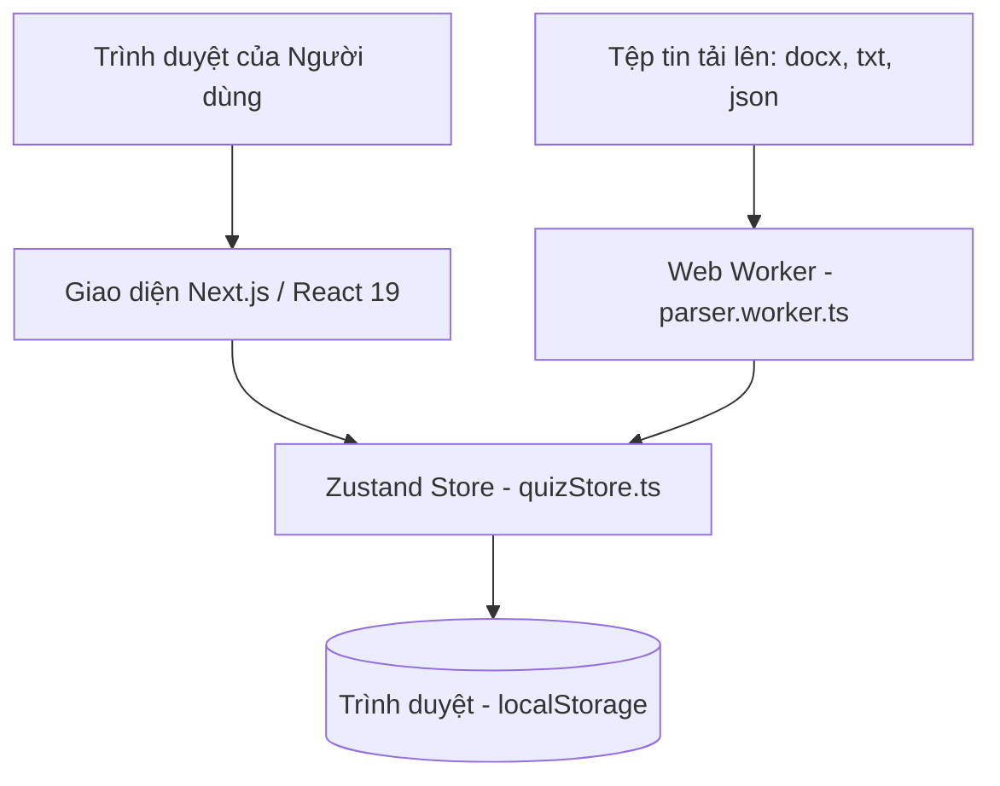

# Kiến trúc Dự án (Architecture)

Tài liệu này chi tiết hóa mô hình kiến trúc, các luồng dữ liệu (data flows), vòng đời yêu cầu (lifecycle) và cơ chế kết xuất (rendering) của ứng dụng **Vapas Quiz**.

## 1. Mô hình Kiến trúc (Architectural Pattern)

Dự án áp dụng mô hình **Single Page Application (SPA) Client-Only** sử dụng framework Next.js 16 (App Router) nhưng chạy hoàn toàn ở phía trình duyệt (Client-Side). 



- **Không có Backend & Database**: Không sử dụng máy chủ dữ liệu hoặc API trung gian. Dữ liệu được lưu trữ trực tiếp dưới dạng chuỗi JSON trong `localStorage` của trình duyệt.
- **Quản lý trạng thái tập trung**: Tất cả trạng thái hoạt động (tải tệp, làm bài, cài đặt, trình soạn thảo đề thi) đều được lưu trữ và chia sẻ qua một Zustand Store duy nhất tại `src/store/quizStore.ts`.

---

## 2. Ranh giới Mô-đun & Hướng phụ thuộc (Module Boundaries)

Mã nguồn được phân tách rõ ràng thành các tầng có ranh giới phụ thuộc một chiều (hướng đi từ ngoài vào trong):

1. **Tầng Giao diện (Page & Layout)** (`src/app/`): Điểm truy cập của ứng dụng (`/` và `/document`). Tầng này thực hiện nạp dữ liệu ban đầu (hydration) và phân bổ kết xuất các component.
2. **Tầng Component độc lập** (`src/components/`): Các khối chức năng giao diện (`FileManager`, `MainQuiz`, `Sidebar`,...). Các component chỉ sử dụng dữ liệu từ Store hoặc thông qua các hàm tiện ích (`utils`), không tự ý thao tác trực tiếp với `localStorage`.
3. **Tầng Quản lý trạng thái (Store)** (`src/store/`): Nơi nắm giữ toàn bộ state và các action thay đổi state của ứng dụng.
4. **Tầng Thư viện xử lý & Tiện ích (Lib/Utils)** (`src/lib/`): Các hàm thuần túy (pure functions) xử lý thuật toán phân tích cú pháp (`parserCore.ts`), định dạng Markdown (`markdownHelper.ts`), và các hàm tiện ích tính toán bộ nhớ (`utils.ts`). Các mô-đun này hoàn toàn độc lập và không phụ thuộc vào giao diện hay trạng thái Store.

---

## 3. Các Luồng Dữ liệu Chính (Data Flows)

### A. Luồng tải và phân tích tệp tin (File Import Flow)
Luồng này sử dụng luồng phụ Web Worker để tối ưu hóa hiệu năng, giảm tải cho luồng giao diện chính (Main Thread):

```
[Người dùng tải file] 
       │
       ▼
[Component gọi parseFile(file)]
       │
       ├─► (Nếu có Worker) ──► Post ArrayBuffer sang parser.worker.ts ──► mammoth.js/custom parser ──► Trả kết quả về Main Thread
       │
       └─► (Nếu lỗi Worker) ─► Chạy mammoth.js/custom parser trực tiếp trên Main Thread
       │
       ▼
[Cập nhật trạng thái vào Zustand Store]
       │
       ▼
[useEffect ở page.tsx lắng nghe và tự động lưu chuỗi JSON vào localStorage]
```

### B. Luồng khởi tạo và thực thi làm bài (Quiz Execution Flow)
1. **Lọc câu hỏi**: Khi nhấn "Bắt đầu", ứng dụng đọc toàn bộ câu hỏi từ các nguồn tệp đang được chọn hoạt động (`active: true`).
2. **Cắt lát & Phân bổ (Slicing & Allocation)**: Nếu chọn chế độ `CUSTOM` số lượng câu hỏi, store sẽ tính toán số lượng câu hỏi cần lấy từ từng tệp dựa trên cấu hình phân bổ tỷ lệ `sourceAllocations` (hoặc phân bổ đều nếu không cấu hình tỷ lệ).
3. **Trộn ngẫu nhiên (Shuffling)**: Dùng thuật toán Fisher-Yates (`shuffleArray`) để trộn thứ tự câu hỏi đồng thời trộn ngẫu nhiên thứ tự đáp án (options) của từng câu.
4. **Theo dõi thời gian (Timer & Tracking)**:
   - Ghi nhận `startTime` bằng `performance.now()` hoặc `Date.now()`.
   - Khi chuyển câu hỏi hoặc tạm dừng (Pause), thời gian làm bài của phiên hiện tại được cộng dồn vào `accumulatedTime` và `questionTimes[questionId]`.
5. **Nộp bài (Submit)**: Lưu kết quả cuối cùng, tính tỷ lệ chính xác và chuyển trạng thái sang `COMPLETED` để kích hoạt `ResultScreen`.

### C. Luồng đồng bộ trạng thái (Hydration & Persistence Flow)
Vì Zustand chạy trên bộ nhớ tạm (in-memory) và Next.js có cơ chế tiền kết xuất máy chủ (SSR), việc đọc `localStorage` ngay lập tức có thể gây ra hiện tượng không khớp thuộc tính kết xuất (hydration mismatch). 
- **Giải pháp**: Trang chủ sử dụng cờ `hasHydrated` (state cục bộ). Ban đầu kết xuất giao diện mặc định, sau khi Component Mount (`useEffect` chạy), dữ liệu từ `localStorage` được nạp vào Zustand Store và chuyển `hasHydrated` thành `true`. Lúc này các hành động thay đổi dữ liệu mới bắt đầu được ghi ngược lại `localStorage`.

---

## 4. Triết lý Kết xuất & Tối ưu hóa Hiệu năng (Rendering & Optimization)

### A. Progressive Rendering (Kết xuất Markdown theo tiến trình)
Khi xem một tài liệu học tập dài ở `/document`, việc render toàn bộ mã HTML Markdown cùng một lúc thông qua `ReactMarkdown` có thể gây đơ màn hình từ 1-2 giây. 
- **Cơ chế tối ưu**: Trong [MarkdownRenderer](file:///c:/Documents/Project/Code/Quiz%20Standard/Quiz/src/components/MarkdownRenderer.tsx), tài liệu được phân tách thành danh sách các khối (blocks) độc lập (Heading, Paragraph, Table, Code Block) bởi hàm `splitMarkdownIntoBlocks`.
- Bộ render sử dụng `requestAnimationFrame` để tăng dần số lượng khối hiển thị (`visibleBlocks`) sau mỗi khung hình vẽ (mỗi đợt 15 khối). Điều này giúp tài liệu xuất hiện ngay lập tức và tải dần trong nền mà không gây nghẽn UI Thread.

### B. Ngăn chặn Re-render thừa bằng Selector
Zustand Store chứa rất nhiều trạng thái khác nhau. Nếu một React Component đăng ký toàn bộ store:
`const state = useQuizStore();`
Component đó sẽ bị re-render mỗi khi bất kỳ thuộc tính nào trong store thay đổi (ví dụ: bộ đếm giờ cập nhật mỗi giây sẽ làm đơ trình biên soạn câu hỏi).
- **Giải pháp**: Tất cả các component trong dự án đều tuân thủ quy tắc đăng ký thông qua **Specific Selectors**:
  `const sources = useQuizStore(s => s.sources);`
  `const theme = useQuizStore(s => s.theme);`
- Việc thao tác ghi đè trạng thái trong các hàm xử lý sự kiện hoặc callback ngoài React được gọi trực tiếp qua:
  `useQuizStore.getState().setX(...)`
  để tránh hoàn toàn việc đăng ký lắng nghe giao diện (hook subscription).
