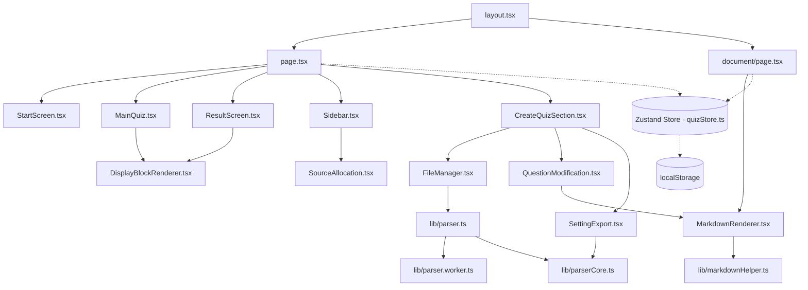

# Sơ đồ Phụ thuộc (Dependency Graph)

Tài liệu này phân tích và trực quan hóa mối quan hệ phụ thuộc (dependencies) giữa các mô-đun, trang và component trong ứng dụng **Vapas Quiz**.

## 1. Sơ đồ Quan hệ Mô-đun (Module Relations Diagram)

Sơ đồ dưới đây biểu diễn cách các trang chính nạp các component con, cũng như cách các component tương tác với tầng xử lý logic và tầng lưu trữ trạng thái:

---

## 2. Mô tả Quan hệ Chi tiết

### A. Tầng Định tuyến và Bố cục (Layout & Pages)
- **`layout.tsx`**: Bố cục chung cấp gốc, nạp phông chữ, định nghĩa thẻ metadata và tích hợp bộ đo lường `@vercel/analytics/next`.
- **Trang chủ (`page.tsx`)**: Đóng vai trò là trình phân luồng giao diện chính. Lắng nghe trạng thái `state` của Zustand store để kết xuất màn hình tương ứng (`StartScreen`, `MainQuiz`, hoặc `ResultScreen`), hoặc hiển thị trình kiến tạo `CreateQuizSection`. Trang chủ cũng chịu trách nhiệm nạp/ghi dữ liệu từ `localStorage` thông qua hook `useEffect` khi mount/cập nhật.

### B. Trình Kiến tạo câu hỏi (`CreateQuizSection.tsx`)
- Đóng vai trò là container lưới (Grid Layout) để gắn kết 3 component chính:
  * **`FileManager.tsx` (Cột 1)**: Quản lý danh sách tệp. Phụ thuộc vào dịch vụ đọc file bất đồng bộ `parseFile` (`src/lib/parser.ts`) và gửi các Action cập nhật tệp tin lên Store.
  * **`QuestionModification.tsx` (Cột 2)**: Trình chỉnh sửa câu hỏi. Phụ thuộc vào `MarkdownRenderer` để xem trước tài liệu và `PrismJS` để tô màu cú pháp trong trình sửa code JSON thô.
  * **`SettingExport.tsx` (Cột 3)**: Xuất đề thi và ghi chú. Phụ thuộc vào `parseQuizJson` để tự động kiểm thử tính hợp lệ của JSON trước khi xuất bản.
- Chia sẻ chung các trạng thái bộ lọc giao diện (`filterType`, `filterOthers`, `selectedTagsFilter`) thông qua cơ chế React Props từ Component cha `CreateQuizSection`.

### C. Giao diện làm bài (`MainQuiz.tsx`) & Kết quả (`ResultScreen.tsx`)
- **`MainQuiz.tsx`**: Phụ thuộc vào `DisplayBlockRenderer.tsx` để kết xuất các khối code tin học hoặc hình ảnh đính kèm trong câu hỏi. Sử dụng các component Timer nội bộ để đếm giờ làm bài.
- **`ResultScreen.tsx`**: Sử dụng lại `DisplayBlockRenderer.tsx` trong phần xem lại danh sách câu trả lời sai.

### D. Tầng Xử lý Logic nội bộ (`src/lib/`)
- **`parser.ts`**: Đầu mối điều phối xử lý tệp. Nạp động (dynamic load URL) Web Worker `parser.worker.ts`. Nếu Worker lỗi, nạp `mammoth` và `parserCore.ts` để phân tích ngay trên Main Thread.
- **`markdownHelper.ts`**: Cung cấp hàm tách khối văn bản cho component `MarkdownRenderer.tsx` để tối ưu hóa kết xuất.
- **`utils.ts`**: Chứa các hàm dùng chung để tính toán dung lượng tệp (`getItemBytes`), định dạng dữ liệu, sinh màu sắc thẻ và ghi nhật ký render (`useRenderProfiler`).
